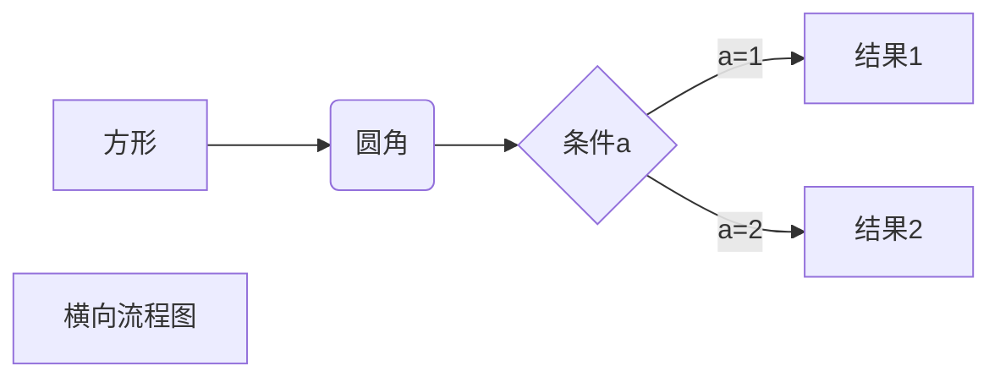

# Markdown_Notes
## 1.代码块及单行代码
```python
if ZhanWenxiang is god:
  print('ZhangWenxiang is god forever')
```
`print('hello world')`
## 2.字体
**张文祥**
~~张文祥~~
*张文祥*
***张文祥***

## 3.引用
>张文祥
>>张文祥

## 4.分割线
---
***

## 5.插入图片


## 6.超链接
[北科大](https://www.ustb.edu.cn/)

## 7.插入表格
名字|年龄|属性
---|---|:---:
张文祥|25岁|宅男
张旭锋|25岁|文艺青年

## 8.列表
* python
  * java

## 9.画图


```flow
st=>start: 开始框
op=>operation: 处理框
cond=>condition: 判断框(是或否?)
sub1=>subroutine: 子流程
io=>inputoutput: 输入输出框
e=>end: 结束框
st->op->cond
cond(yes)->io->e
cond(no)->sub1(right)->op
```
